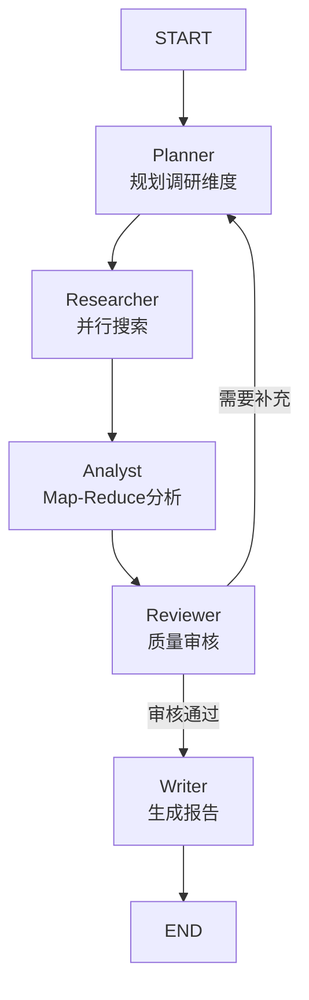

# 🔍 自动化研报 Agent

基于 LangGraph 的多智能体调研系统，支持多步规划、并行搜索、Map-Reduce 分析、自反思重试，以及投行风格 Markdown 报告输出。

## ✨ 功能特性

- **智能规划**：自动拆解调研主题为 3-5 个专业检索维度
- **并行搜索**：集成 Tavily/SerpAPI，支持高级搜索深度和 PDF 内容提取
- **Map-Reduce 分析**：先去噪提取单篇材料，再汇总交叉验证
- **自反思重试**：Reviewer 发现信息缺口自动回退重规划（最多 2 轮）
- **多模型支持**：OpenAI、Anthropic Claude、阿里云 Qwen、讯飞星火
- **状态持久化**：SQLite 断点续跑 + LangSmith 链路观测
- **双端交付**：命令行工具 + Web 可视化界面

## 🏗️ 架构设计

```
START → Planner → Researcher → Analyst → Reviewer → [Planner ↻ / Writer] → END
```

| 节点 | 职责 | 核心能力 |
|------|------|----------|
| **Planner** | 调研规划 | 生成检索维度与查询词 |
| **Researcher** | 信息检索 | 并行调用搜索 API |
| **Analyst** | 结构化分析 | Map-Reduce 事实提取 |
| **Reviewer** | 质量审核 | 自反思决策路由 |
| **Writer** | 报告撰写 | 投行风格 Markdown |

## 🛠️ 技术栈

- **多智能体框架**: LangGraph >= 0.2.60
- **LLM 集成**: LangChain-OpenAI / LangChain-Anthropic
- **搜索服务**: Tavily Search / SerpAPI
- **PDF 解析**: PyMuPDF
- **Web 服务**: FastAPI + Uvicorn + Jinja2
- **状态持久化**: LangGraph SQLite Checkpointer

## 🚀 快速开始

### 安装依赖

```bash
pip install -r requirements.txt
```

### 配置环境变量

复制 `.env.example` 为 `.env` 并填入：

```bash
# 模型配置（四选一）
MODEL_PROVIDER=openai
OPENAI_API_KEY=your_key_here

# 搜索服务（二选一）
TAVILY_API_KEY=your_key_here
# 或
SERPAPI_API_KEY=your_key_here
```

### 运行方式

**命令行模式**：
```bash
python main.py "Tesla"
```

**Web 服务模式**：
```bash
python web_app.py
# 访问 http://localhost:8080
```

## 🔧 配置说明

### 模型供应商

| Provider | 环境变量 | 说明 |
|----------|----------|------|
| OpenAI | `MODEL_PROVIDER=openai` | 默认，支持自定义 base_url |
| Anthropic | `MODEL_PROVIDER=anthropic` | Claude 3.5 Sonnet |
| Qwen | `MODEL_PROVIDER=qwen` | 阿里云百炼，OpenAI 兼容 |
| Xunfei | `MODEL_PROVIDER=xunfei` | 讯飞星火，WebSocket 原生 |

### 搜索服务

| Provider | 环境变量 |
|----------|----------|
| Tavily | `SEARCH_PROVIDER=tavily`（默认） |
| SerpAPI | `SEARCH_PROVIDER=serpapi` |

### 环境变量完整列表

| 变量名 | 说明 | 默认值 |
|--------|------|--------|
| `MODEL_PROVIDER` | LLM 供应商 | openai |
| `OPENAI_API_KEY` | OpenAI API Key | - |
| `OPENAI_MODEL` | OpenAI 模型 | gpt-4o |
| `OPENAI_BASE_URL` | OpenAI 自定义端点 | - |
| `ANTHROPIC_API_KEY` | Anthropic API Key | - |
| `ANTHROPIC_MODEL` | Anthropic 模型 | claude-3-5-sonnet-20241022 |
| `DASHSCOPE_API_KEY` | 阿里云百炼 API Key | - |
| `QWEN_MODEL` | Qwen 模型 | qwen3-max |
| `XUNFEI_API_KEY` | 讯飞 API Key（格式：key:secret） | - |
| `XUNFEI_APP_ID` | 讯飞 App ID | - |
| `TAVILY_API_KEY` | Tavily API Key | - |
| `SERPAPI_API_KEY` | SerpAPI API Key | - |
| `TAVILY_MAX_RESULTS` | 搜索最大结果数 | 8 |
| `TAVILY_TOP_K` | 每查询截取数量 | 5 |
| `MODEL_TEMPERATURE` | LLM 温度参数 | 0.2 |
| `LANGGRAPH_DEBUG` | 调试模式 | false |
| `LANGGRAPH_CHECKPOINT_DB` | SQLite 数据库路径 | agent_state.db |
| `LANGSMITH_TRACING` | LangSmith 追踪 | false |
| `LANGSMITH_API_KEY` | LangSmith API Key | - |

## 📊 使用示例

```bash
# 调研特斯拉
python main.py "Tesla 2024 财报分析"

# 调研人工智能行业
python main.py "AI 大模型 2024 发展趋势"

# 调研新能源汽车市场
python main.py "新能源汽车 2024 市场份额"
```

## 📁 项目结构

```
├── main.py          # 命令行入口
├── web_app.py       # Web 服务入口
├── graph.py         # LangGraph 工作流定义
├── nodes.py         # 智能体节点实现
├── state.py         # 状态数据结构
├── tools.py         # 搜索工具封装（Tavily/SerpAPI）
├── requirements.txt # 依赖清单
├── .env.example     # 环境变量模板
├── .gitignore       # Git 忽略配置
├── Dockerfile       # Docker 配置
├── static/          # 静态资源
└── templates/       # Web 页面模板
```

## 📝 输出示例

生成的研报包含以下结构化内容：

1. **背景** - 行业概况与调研背景
2. **核心竞争力** - 企业/行业核心优势
3. **SWOT 分析** - 优势、劣势、机会、威胁
4. **风险提示** - 潜在风险因素
5. **结论** - 综合判断与建议
6. **参考来源** - 所有引用链接

## 🔄 工作流程图



## 🐳 Docker 部署

```bash
# 构建镜像
docker build -t research-agent .

# 运行容器
docker run -p 8080:8080 --env-file .env research-agent
```

## 📄 License

MIT License

## 🤝 贡献

欢迎提交 Issue 和 Pull Request！

## 📧 联系方式

如有问题或建议，欢迎通过以下方式联系：

- GitHub Issues: [https://github.com/v40132669-cloud/research-agent/issues](https://github.com/v40132669-cloud/research-agent/issues)